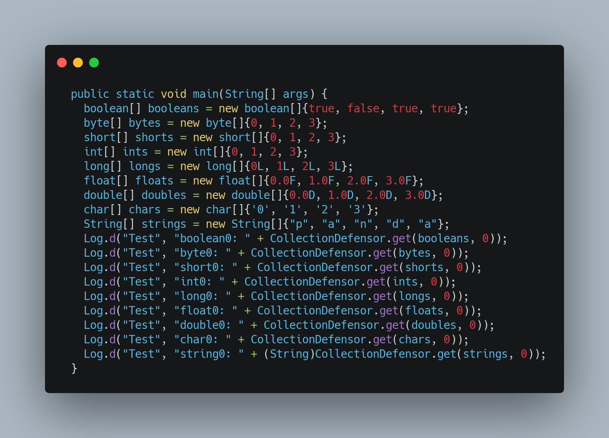

# Defensor

[](https://www.apache.org/licenses/LICENSE-2.0)
[](https://search.maven.org/artifact/io.github.porum/defensor/1.3.6/aar)
[](https://search.maven.org/artifact/io.github.porum/defensor-gradle-plugin/1.3.6/jar)

Defensor is a gradle plugin for Android that reduces the crash of Application.

## Adding dependencies

First, add `defensor-gradle-plugin` to your project, include the following `classpath` in your top level `build.gradle` file:

```groovy
buildscript {
    repositories {
        // ...
        mavenCentral()
    }
    dependencies {
        // ...
        classpath "io.github.porum:defensor-gradle-plugin:$version"
    }
}
```

Then, apply the Gradle plugin and add these dependencies in your **app or module's** `build.gradle` file:

```groovy
// ...
apply plugin: "defensor"

dependencies {
    // ...
    implementation "io.github.porum:defensor:$version"
}
```

## Configuration

Defensor plugin can be configured using `defensor` extension object:

```groovy
defensor {
    excludes = [
        // exclude specified packages or classes
    ]
}
```

## Usage

```kotlin
CrashDefensor.init(
  CrashDefensor.Config()
    .setApplicationId("applicationId")
    .setEnableThrow(true)
)

CrashDefensor.setCrashCaughtListener { code, msg, th ->
  Log.i("CrashDefensor", "[$code] $msg $th")
}
```

## Decompile

|             Before             |            After             |
| :----------------------------: | :--------------------------: |
|  |  |

## Wiki

https://github.com/porum/Defensor/wiki

## License

```
Copyright (c) 2021-present, porum

Licensed under the Apache License, Version 2.0 (the "License");
you may not use this file except in compliance with the License.
You may obtain a copy of the License at

   http://www.apache.org/licenses/LICENSE-2.0

Unless required by applicable law or agreed to in writing, software
distributed under the License is distributed on an "AS IS" BASIS,
WITHOUT WARRANTIES OR CONDITIONS OF ANY KIND, either express or implied.
See the License for the specific language governing permissions and
limitations under the License.
```

