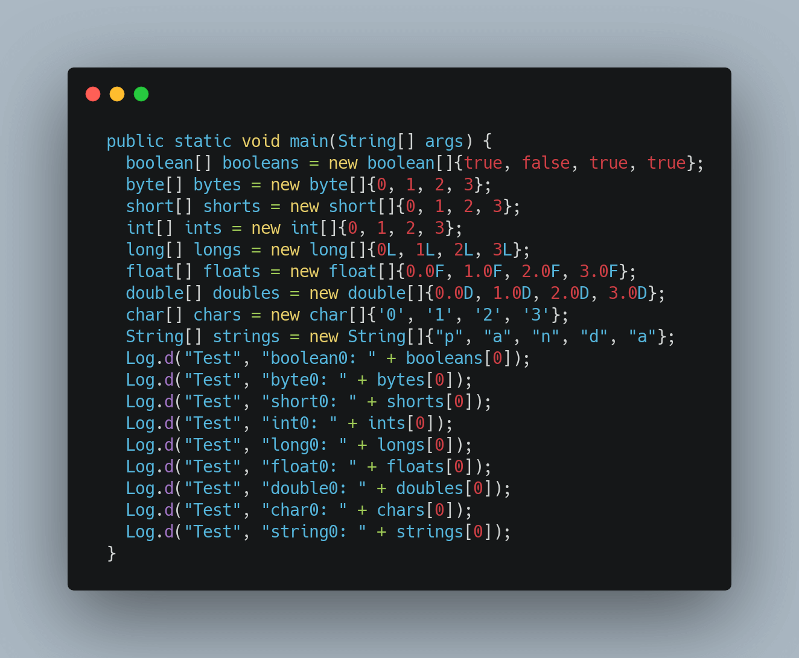

# Defensor

[](https://www.apache.org/licenses/LICENSE-2.0)
[](https://search.maven.org/artifact/io.github.porum/defensor/1.3.1-SNAPSHOT/aar)
[](https://search.maven.org/artifact/io.github.porum/defensor-gradle-plugin/1.3.1-SNAPSHOT/jar)

Defensor is a gradle-plugin that can reduce Android App crashes.

## Usage

To add a dependency on `defensor`, you must add the Maven Central repository to your project.

Add the dependencies for the artifacts you need in the `build.gradle` file for your app or module:

```groovy
dependencies {
    implementation "io.github.porum:defensor:$version"
}
```

To add `defensor-gradle-plugin` to your project, include the following `classpath` in your top level `build.gradle` file:

```groovy
buildscript {
    repositories {
        mavenCentral()
    }
    dependencies {
        classpath "io.github.porum:defensor-gradle-plugin:$version"
    }
}
```

To generate Java language code suitable for Java or mixed Java and Kotlin modules, add this line to **your app or module's** `build.gradle` file:

```groovy
apply plugin: "defensor"
```

## Advance Usage

- #### support `excludes` packages/classes

  ```groovy
  defensor {
      excludes = [
              "android",
              "androidx",
              "kotlin",
              "kotlinx",
              "yourpackage.YourClass"
      ]
  }
  ```

- #### support `setCrashCaughtListener`

  ```kotlin
  CrashDefensor.init(
    CrashDefensor.Config()
      .setApplicationId(“applicationId”)
      .setEnableThrow(true)
  )
  CrashDefensor.setCrashCaughtListener { code, msg, th ->
    Log.i("CrashDefensor", "[$code] $msg $th")
  }
  ```

## Decompile

|             Before             |            After             |
| :----------------------------: | :--------------------------: |
|  |  |


## License

```
Copyright 2021 porum.

Licensed under the Apache License, Version 2.0 (the "License");
you may not use this file except in compliance with the License.
You may obtain a copy of the License at

   http://www.apache.org/licenses/LICENSE-2.0

Unless required by applicable law or agreed to in writing, software
distributed under the License is distributed on an "AS IS" BASIS,
WITHOUT WARRANTIES OR CONDITIONS OF ANY KIND, either express or implied.
See the License for the specific language governing permissions and
limitations under the License.
```

